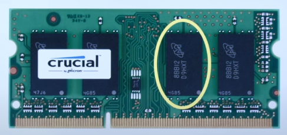
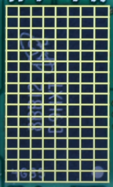

# 🖥️ Arrays (배열)

## 🧠 Memory (메모리에서의 저장 방식)

### 자료형별 메모리 사용량 📌

| **Type**  | **사용 메모리**  |
|-----------|---------------|
| `bool`    | 1 byte       |
| `int`     | 4 bytes      |
| `long`    | 8 bytes      |
| `float`   | 4 bytes      |
| `double`  | 8 bytes      |
| `char`    | 1 byte       |
| `string`  | ❓ **? bytes** (가변적) |

❓ **Q. 위 표에서 의문점을 찾아보세요.**  

👉 `string`의 크기가 `? bytes`로 표시된 이유는 무엇일까요?  

---

## 🏗️ **메모리 구조 살펴보기**

### 📌 실제 메모리 하드웨어 구조
  
  

---

## 🎯 **3번의 시험 점수를 저장하는 코드**

```c
int score1 = 72;
int score2 = 73;
int score3 = 33;
```

## 📌 메모리 안에 저장될 모습:

|    |    |    |    |    |    |    |    |
|---------|---------|---------|---------|---------|---------|---------|---------|
|    |  00000000 00000000 00000000 01001000  |    |    |    |  00000000 00000000 00000000 01001001  |    |    |
|    |  00000000 00000000 00000000 00100001  |    |    |    |  🟩 공백 (Unused Space)  |    |    |


## 🚨 Q. 아래 코드의 문제점을 찾아보세요!

```c
#include <stdio.h>
int main(void)
{
    int score1 = 72;
    int score2 = 73;
    int score3 = 33;

    printf("Average: %f\n", (score1 + score2 + score3) / 3)
}
```

📌 문제점:

❌ 정수 연산 후 실수로 출력 → score1 + score2 + score3는 int이므로, 나누기 3을 하면 소수점이 버려짐!

## 그럼 아래와 같이 배열로 바꾸면 장점은?

```c
int scores[3] = {72, 73, 33};
int sum = 0;
for (int i = 0; i < 3; i++) {
    sum += scores[i];
}
printf("Average: %f\n", sum / 3.0);
```

✅ 장점

1️⃣ 반복문을 활용해 코드가 간결해짐

2️⃣ 데이터 개수가 늘어나도 쉽게 확장 가능

3️⃣ 재사용성 증가 – 동일한 코드 구조로 다양한 크기의 배열 처리 가능


## 데이터가 많아진다면
  ```c
  int score1 = 72, score2 = 73, score3 = 33, score4 = 80, ..., score100 = 95;
  double average = (score1 + score2 + score3 + score4 + ... + score100) / 100.0;
  ```

😵 하드코딩이 너무 많음...!

✅ 배열로 해결하면?

```c
int scores[100] = {72, 73, 33, 80, ..., 95};
int sum = 0;
for (int i = 0; i < 100; i++) {
    sum += scores[i];
}
printf("Average: %f\n", sum / 100.0);
```

- 이렇게 쓰는게 이득. 더 바꿀 수 있다면?


## 🤯 C 언어의 충격적인 점

🚨 배열의 길이를 알려주는 내장 함수가 없다! 🚨

따라서 전체 크기 / 요소의 크기로 나누어 **직접** 연산해야한다.

WHY? C에서는 배열이 단순히 메모리 블록으로 여겨지기 때문.